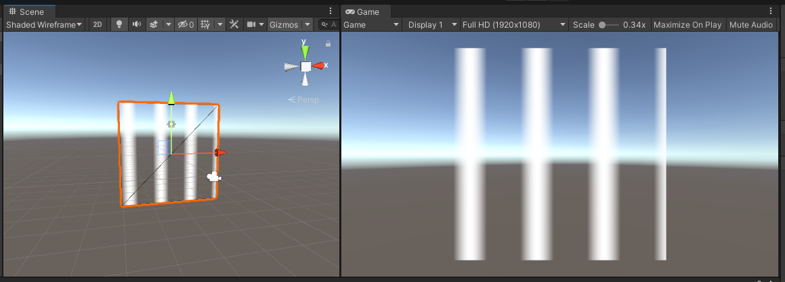
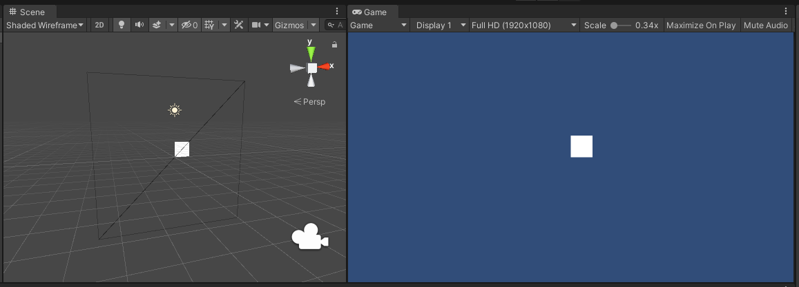
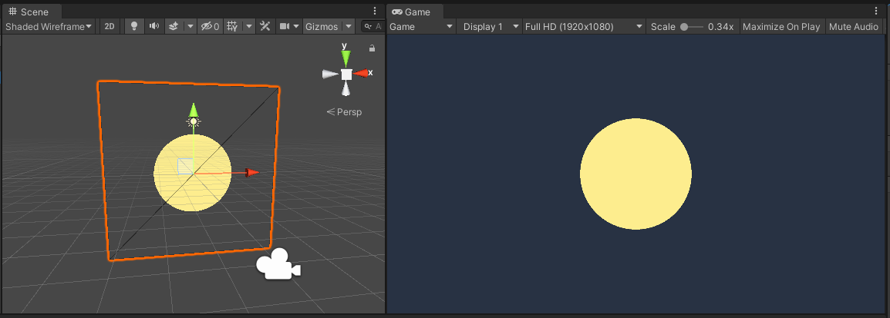

# shaderdev
A shaderdev.com practice project 

## Lesson 4. Bare-bone shader

Shader code [BareBone.shader](Assets/Shaders/BareBone/BareBone.shader)

## Lesson 8. Blending

Shader code [BlendTest.shader](Assets/Shaders/Blending/BlendTest.shader)

## Lesson 9. Texture Mapping

Shader code [Texture.shader](Assets/Shaders/Texture/Texture.shader)

## Lesson 10. Gradient Pattern

Shader code [Gradient.shader](Assets/Shaders/Gradient/Gradient.shader)

## Lesson 11. Wave Function

Shader code [Wave.shader](Assets/Shaders/Wave/Wave.shader)

## Lesson 12. Line Pattern

Shader code [Line.shader](Assets/Shaders/Line/Line.shader)

## Lesson 13. Unions and Intersection

Shader code [Union.shader](Assets/Shaders/Union/Union.shader)

Shader code [Intersection.shader](Assets/Shaders/Intersection/Intersection.shader)

## Lesson 14. Circle

Shader code [Circle.shader](Assets/Shaders/Circle/Circle.shader)